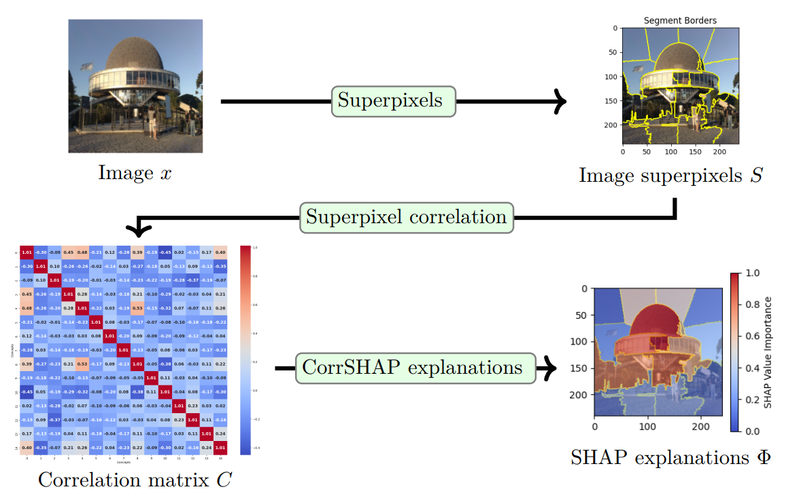

# Superpixel Correlation for Explainable Image Classification

This repository is the official implementation of [Superpixel Correlation for Explainable Image Classification](). 

In this paper, we introduce Correlation SHAP (CorrSHAP), a novel approach that leverages image superpixel correlations to significantly accelerate SHAP value estimation while preserving the rigor of the original formulation. 



## Requirements

To install requirements:

```setup
pip install -r requirements.txt
```

## Results

### Qualitative evaluation

Example of correlations for different proposed approaches for random ImageNet image. Run concept_importance.ipynb and Evaluation_ConceptCorrelationSHAP.ipynb to reproduce these results.


### Quantitative results

Running concept_correlation_SHAP.py

